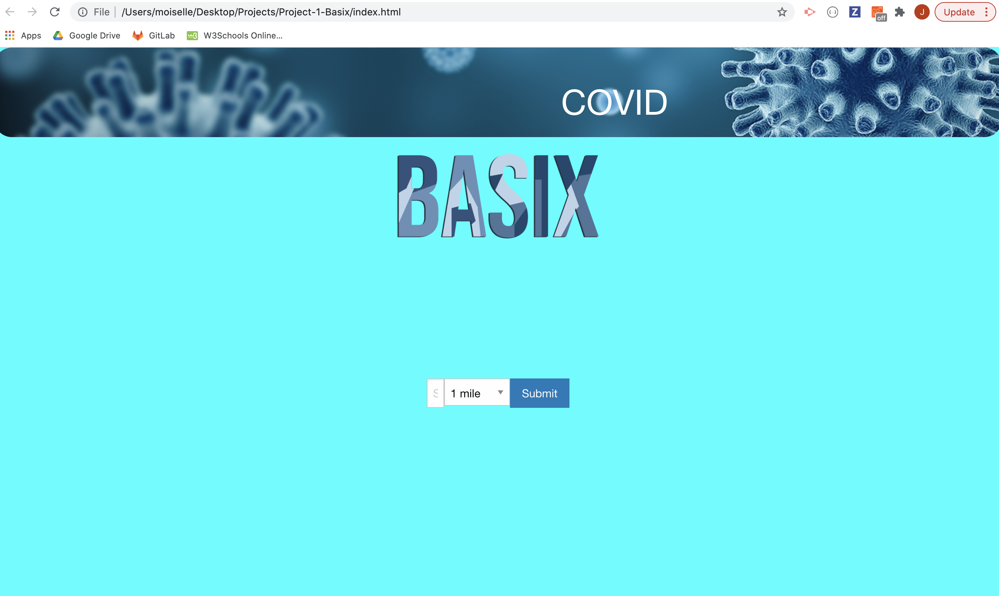

# Project-1-Basix

## Table of Contents
    > Description
    > Prerequisites
    > Technologies
    > API References
    > Installation
    > Screenshots
    > Contributors

### Description
This application was created to reduce panic buying and generate a more efficient & seamless customer experience. When a customer is in need of covid-essential items they are able to assess the availability of the desired products in stores within their vicinity.  Then determine which store to shop contingent upon the product results and the store's distance.

### Prerequisites
It is a possibility that you may need to use CORS or Cross Origin Resource Sharing due to browsers being blocked by default when using JavaScript APIs.  Simply activate the add-on and perform the request - this will allow you to unblock this feature. Typically the icon is an orange letter C when activated.

### Technologies
- Javascript Framework
- JQuery
- CSS Framework
- Foundation 6
- Walgreens API to select store location within radius of user input and retrieve product information into the UI
- Walmart Labs API to select store location within radius of user input & retrieve product information into the UI  
- Deployment: Github pages
- Technical Overview:   the location will be used to make API calls for the storeID’s from the local retailers. The storeID’s will be used to make store-specific API calls for the inventory status of multiple products found within these stores. Foundation components will be used to display these query results in a user-friendly manner. Foundation components will be used to filter results.

### API References

### Installation
How to use: first you will land on the Basix's homepage - where you will enter your zipcode and select your radius that will determine how far you wish to travel.  Once the previously mentioned fields have been entered you then select the submit button.  The submit button in turn prompts the user to the results page.  All product results from stores within the users radius will display on the results page then the user will have the option to select a specific category in order to filter product results.  The filters are used to activate/deactivate certain categories.  If a filter is utilized the results page will then return the product results based on the filter selection.

### Screenshots

### Contributors
Chris Nguyen
Jade Porter
Jonnah Marie Pangilinan
Ricardo Matamoros
Van Taymany
